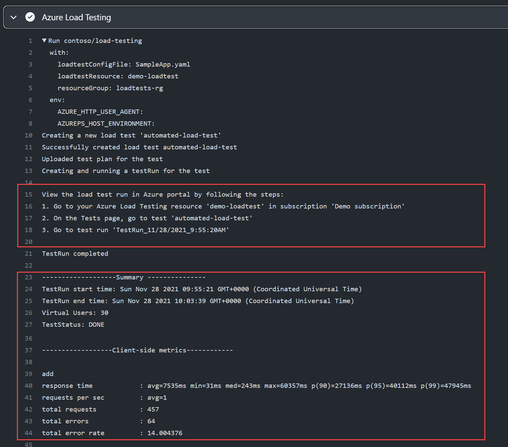

---
lab:
  title: "Labo\_03\_: automatiser le test de charge Azure à l’aide de GitHub\_Actions "
  module: 'Module 3: Implement Azure Load Testing'
---

# Vue d’ensemble

Dans ce labo, vous apprenez à configurer GitHub Actions pour déployer un exemple d’application web et démarrer un test de charge à l’aide du test de charge Azure.

Dans ce labo, vous allez :

* Créez des ressources App Service et Load Testing dans Azure.
* Créez et configurez un principal de service pour permettre aux flux de travail GitHub Actions d’effectuer des actions dans votre compte Azure.
* Déployez une application .NET 8 sur Azure App Service à l’aide d’un workflow GitHub Actions.
* Mise à jour d'un flux de travail GitHub Actions pour invoquer un test de charge basé sur une URL.

**Durée estimée : 40 minutes**

## Prérequis

* Un **compte Azure** avec un abonnement actif. Si vous n’en avez pas, vous pouvez vous inscrire à une évaluation gratuite dans la page [https://azure.com/free](https://azure.com/free).
    * Un portail web Azure pris en charge [navigateur](https://learn.microsoft.com/azure/azure-portal/azure-portal-supported-browsers-devices).
    * Un compte Microsoft ou un compte Microsoft Entra avec le rôle Contributeur ou Propriétaire dans l'abonnement Azure. Pour plus d’informations, consultez [Répertorier les attributions de rôle Azure à l’aide du portail Azure](https://docs.microsoft.com/azure/role-based-access-control/role-assignments-list-portal) et [Afficher et attribuer des rôles d’administrateur dans Azure Active Directory](https://docs.microsoft.com/azure/active-directory/roles/manage-roles-portal).
* Un compte GitHub. Si vous n’avez pas de compte GitHub utilisable pour ce labo, suivez les instructions disponibles dans [Inscription à un nouveau compte GitHub](https://github.com/join) pour en créer un.


## Instructions

## Exercice 1 : importer l’exemple d’application dans votre référentiel GitHub

Dans cet exercice, vous allez importer l’[exemple d’application de test de charge Azure](https://github.com/MicrosoftLearning/azure-load-test-sample-app) dans votre propre compte GitHub.

### Tâche 1 : importer le référentiel eShopOnWeb

1. Dans votre navigateur web, accédez à GitHub [http://github.com](http://github.com) et connectez-vous à l’aide de votre compte.
1. Démarrez le processus d’importation [https://github.com/new/import](https://github.com/new/import).
1. Entrez les informations suivantes dans la page **Importer votre projet dans GitHub**.

    | Setting | Action |
    |--|--|
    | **URL de votre référentiel source** | Entrez `https://github.com/MicrosoftLearning/azure-load-test-sample-app` |
    | **Propriétaire** | Sélectionnez votre alias GitHub |
    | **Nom du référentiel** | Nommez votre référentiel. |
    | **Confidentialité** | Une fois le **Propriétaire** sélectionné, les options de confidentialité s’affichent. Sélectionnez **Public**. |

1. Sélectionnez **Commencer l’importation** et attendez que le processus d’importation se termine.
1. Dans la page du nouveau référentiel, sélectionnez **Paramètres**, puis sélectionnez **Actions > Général** dans le volet de navigation de gauche.
1. Dans la section **Autorisations Actions** de la page, sélectionnez l’option **Autoriser toutes les actions et tous les workflows réutilisables**, puis sélectionnez **Enregistrer**.

## Exercice 2 : créer des ressources dans Azure

Dans cet exercice, vous créez les ressources dans Azure nécessaires pour déployer l’application et exécuter le test. 

### Tâche 1 : créer des ressources à l’aide d’Azure CLI

Dans cette tâche, vous créez les ressources Azure suivantes :

* Resource group
* Plan App Service
* Instance de service d’application
* Instance Test de charge

1. Dans votre navigateur, accédez au portail Azure [https://portal.azure.com](https://portal.azure.com).
1. Ouvrez le **Cloud Shell**, puis sélectionnez le mode **Bash**. **Remarque :** vous devrez peut-être configurer le stockage persistant si c’est la première fois que vous lancez le Cloud Shell.

1. Exécutez les commandes suivantes, une à la fois, pour créer des variables utilisées dans les commandes dans les étapes restantes. Remplacez `<mylocation>` par votre emplacement préféré.

    ```
    myLocation=<mylocation>
    myAppName=az2006app$RANDOM
    ```
1. Exécutez la commande suivante pour créer le groupe de ressources destiné à contenir les autres ressources.

    ```
    az group create -n az2006-rg -l $myLocation
    ```

1. Exécutez la commande suivante pour inscrire le fournisseur de ressources au **Azure App Service**.

    ```bash
    az provider register --namespace Microsoft.Web
    ```

1. Exécutez la commande suivante pour créer le Plan App Service. **Remarque :** le plan B1 utilisé dans le Plan App Service peut entraîner des coûts. 

    ```
    az appservice plan create -g az2006-rg -n az2006webapp-plan --sku B1
    ```

1. Exécutez la commande suivante pour créer l’instance App Service pour l’application.

    ```
    az webapp create -g az2006-rg -p az2006webapp-plan -n $myAppName --runtime "dotnet:8"
    ```

1. Exécutez la commande suivante pour créer une ressource de test de charge. Si vous êtes invité à installer l’extension de **charge**, choisissez « oui ».

    ```
    az load create -n az2006loadtest -g az2006-rg --location $myLocation
    ```

1. Exécutez les commandes suivantes pour récupérer votre ID d’abonnement. **Remarque :** veillez à copier et enregistrer la sortie à partir des commandes, la valeur d’ID d’abonnement est utilisée ultérieurement dans ce labo.

    ```
    subId=$(az account list --query "[?isDefault].id" --output tsv)
    
    echo $subId
    ```

### Tâche 2 : créer le principal de service et configurer l’autorisation

Dans cette tâche, vous créez un principal de service pour l’application et vous le configurez pour l’authentification fédérée OpenID Connect.

1. Dans le portail Azure, recherchez **Microsoft Entra ID** et accédez au service.

1. Dans le volet de navigation de gauche, sélectionnez **Inscriptions d’applications** dans le groupe **Gérer**. 

1. Sélectionnez **+ Nouvelle inscription** dans le panneau principal et entrez le nom `GH-Action-webapp`, puis sélectionnez **S’inscrire**.

    >**IMPORTANT :** copiez et enregistrez les valeurs **ID d’application (client)** et **ID de répertoire (locataire)** pour les utiliser ultérieurement dans ce labo.


1. Dans le volet de navigation de gauche, sélectionnez **Certificats et secrets** dans le groupe **Gérer**, puis, dans la fenêtre principale, sélectionnez **Informations d’identification fédérées**. 

1. Sélectionnez **Ajouter des informations d’identification**, puis **GitHub Actions déployant des ressources Azure** dans la liste déroulante de sélection.

1. Entrez les informations suivantes dans la section **Connecter votre compte GitHub**. **Remarque :** ces champs respectent la casse. 

    | Champ | Action |
    |--|--|
    | Organisation | Entrez votre nom d’utilisateur ou d’organisation. |
    | Dépôt | Entrez le nom du référentiel que vous avez créé précédemment dans le labo. |
    | Type d'entité | Sélectionner **Branche**. |
    | Nom de la branche GitHub | Entrez **main**. |

1. Dans la section **Détails des informations d’identification**, attribuez un nom à vos informations d’identification, puis sélectionnez **Ajouter**.

### Tâche 3 : attribuer des rôles au principal de service

Dans cette tâche, vous attribuez les rôles nécessaires au principal de service pour accéder à vos ressources.

1. Exécutez les commandes suivantes pour attribuer le rôle « Contributeur de test de charge » afin que le workflow GitHub puisse envoyer les tests de ressources à exécuter. 

    ```
    spAppId=$(az ad sp list --display-name GH-Action-webapp --query "[].{spID:appId}" --output tsv)

    loadTestId=$(az resource show -g az2006-rg -n az2006loadtest --resource-type "Microsoft.LoadTestService/loadtests" --query "id" -o tsv)

    az role assignment create --assignee $spAppId --role "Load Test Contributor"  --scope $loadTestId
    ```

1. Exécutez la commande suivante pour attribuer le rôle « contributeur » afin que le workflow GitHub puisse déployer l’application sur App Service. 

    ```
    rgId=$(az group show -n az2006-rg --query "id" -o tsv)
    
    az role assignment create --assignee $spAppId --role contributor --scope $rgId
    ```

## Exercice 3 : déployer et tester l’application web à l’aide de GitHub Actions

Dans cet exercice, vous configurez votre référentiel pour exécuter les workflows inclus.

* Les workflows se trouvent dans le dossier *.github/workflows* du référentiel.
* Les deux workflows, *deploy.yml* et *loadtest.yml*, sont configurés pour s’exécuter manuellement.

Pendant cet exercice, vous modifiez les fichiers du référentiel dans le navigateur. Après avoir sélectionné un fichier à modifier, vous pouvez :
* Sélectionner **Modifier directement** et lorsque vous avez terminé la modification, valider les modifications. 
* Ouvrir le fichier avec **github.dev** pour modifier avec Visual Studio Code dans le navigateur. Si vous choisissez cette option, vous pouvez revenir à l’expérience de référentiel par défaut en sélectionnant **Revenir au référentiel** dans le menu du haut.

    

### Tâche 1 : configurer des secrets

Dans cette tâche, vous ajoutez des secrets à votre référentiel pour permettre aux workflows de se connecter à Azure en votre nom et d’effectuer des actions.

1. Dans votre navigateur web, accédez à [GitHub](https://github.com) et sélectionnez le référentiel que vous avez créé pour ce labo. 
1. Sélectionnez **Paramètres** en haut du référentiel.
1. Dans le volet de navigation de gauche, sélectionnez **Secrets et variables**, puis sélectionnez **Actions**.
1. Dans la section **Secrets du référentiel**, ajoutez les trois secrets suivants. Vous ajoutez un secret en sélectionnant **Nouveau secret de référentiel**.

    | Nom | Secret |
    |--|--|
    | `AZURE_CLIENT_ID` | Entrez l’**ID d’application (client)** que vous avez enregistré précédemment dans le labo. |
    | `AZURE_TENANT_ID` | Entrez l’**ID de répertoire (locataire)** que vous avez enregistré précédemment dans le labo. |
    | `AZURE_SUBSCRIPTION_ID` | Entrez la valeur d’ID d’abonnement que vous avez enregistrée précédemment dans le labo. |

### Tâche 2 : déployer l’application web

1. Sélectionnez le fichier *deploy.yml* dans le dossier *.github/workflows*.

1. Modifiez le fichier puis, dans la section **env:**, modifiez la valeur de la variable `AZURE_WEB_APP`. Remplacez `<your web app name>` par le nom de l’application web créée précédemment dans ce labo. Validez votre modification.

1. Prenez le temps de passer en revue le contenu du workflow.

1. Sélectionnez **Actions** dans le volet de navigation supérieur de votre référentiel. 

1. Sélectionnez **Générer et publier** dans le volet de navigation de gauche.

1. Sélectionnez la liste déroulante **Exécuter le workflow**, puis sélectionnez **Exécuter le workflow** en conservant le paramètre **Branch: main** par défaut. Le démarrage du workflow peut prendre un peu de temps.

Si le wokflow ne s’exécute pas correctement, sélectionnez le workflow **Générer et publier**, puis sélectionnez **générer** sur l’écran suivant. Cette opération fournit des informations détaillées sur le workflow et peut aider à diagnostiquer le problème qui l’a empêché de s’exécuter correctement.

### Tâche 3 : exécuter un test de charge

1. Sélectionnez le fichier *loadtest.yml* dans le dossier *.github/workflows*.

1. Modifiez le fichier puis, dans la section **env:**, modifiez la valeur de la variable `AZURE_WEB_APP`. Remplacez `<your web app name>**` par le nom de l’application web créée précédemment dans ce labo. Validez votre modification.

1. Prenez le temps de passer en revue le contenu du workflow.

1. Sélectionnez **Actions** dans le volet de navigation supérieur de votre référentiel. 

1. Sélectionnez **Test de charge** dans le volet de navigation de gauche.

1. Sélectionnez la liste déroulante **Exécuter le workflow**, puis sélectionnez **Exécuter le workflow** en conservant le paramètre **Branch: main** par défaut. Le démarrage du workflow peut prendre un peu de temps.

    >**Remarque :** l’exécution du workflow peut prendre 5 à 10 minutes. Le test s’exécute pendant deux minutes. La mise en file d’attente et le démarrage du test de charge dans Azure peuvent prendre plusieurs minutes. 

Si le workflow ne s’exécute pas correctement, sélectionnez le workflow **Test de charge**, puis **Générer** sur l’écran suivant. Cette opération fournit des informations détaillées sur le workflow et peut aider à diagnostiquer le problème qui l’a empêché de s’exécuter correctement.

#### Facultatif

Le fichier *config.yaml* à la racine du référentiel spécifie les critères d’échec du test de charge. Si vous souhaitez forcer l’échec du test de charge, effectuez les étapes suivantes.

1. Modifiez le fichier *config.yaml* situé à la racine du référentiel.
1. Remplacez la valeur dans le champ `- p90(response_time_ms) > 4000` par une valeur faible. Son remplacement par `- p90(response_time_ms) > 50` entraînera probablement l’échec du test. Cela représente une réponse de l’application dans les 50 ms à 90 % du temps. 

### Tâche 4 : afficher les résultats du test de charge

Lorsque vous exécutez un test de charge à partir de votre pipeline CI/CD, vous pouvez afficher les résultats récapitulatifs directement dans le journal de sortie CI/CD. Étant donné que les résultats des tests ont été enregistrés en tant qu’artefact de pipeline, vous pouvez également télécharger un fichier CSV pour créer des rapports supplémentaires.



## Exercice 4 : nettoyer les ressources

Dans cet exercice, vous supprimez les ressources créées précédemment dans le labo.

1. Accédez au portail Azure [https://portal.azure.com](https://portal.azure.com) et démarrez Cloud Shell. Sélectionnez la session d’interpréteur de commandes **Bash**.

1. Exécutez la commande suivante pour supprimer le groupe de ressources `az2006-rg`. Elle supprime également le Plan App Service et l’instance App Service.

    ```
    az group delete -n az2006-rg --no-wait --yes
    ```

    >**Remarque** : la commande s’exécute de façon asynchrone (comme déterminé par le paramètre `--no-wait`). Par conséquent, vous serez en mesure d’exécuter une autre commande Azure CLI immédiatement après au cours de la même session Bash, mais la suppression réelle du groupe de ressources prendra quelques minutes.

## Révision

Dans ce labo, vous avez implémenté un workflow GitHub Actions qui déploie et teste la charge d’une application web Azure.
